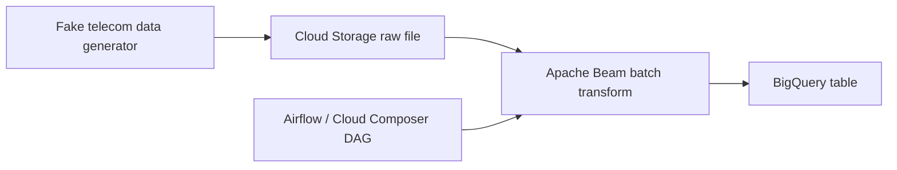

# Telecom Billing

Sample telecom billing pipeline code built around Google Cloud services, Apache Beam, and Airflow. The repository focuses on generating synthetic telecom usage events, loading batch data from Cloud Storage, and preparing that data for BigQuery-based reporting.

## What This Repo Does

The current codebase implements a prototype batch ingestion flow:

1. Generate fake telecom activity such as phone calls, SMS messages, and mobile internet sessions.
2. Upload the generated records as newline-delimited JSON to a Google Cloud Storage bucket.
3. Run an Apache Beam job to transform the raw records into a reporting-friendly schema.
4. Write the transformed output into a BigQuery table.
5. Trigger the Beam batch job from an Airflow DAG running in Cloud Composer or a compatible Airflow environment.

The repository also contains a streaming pipeline starter file, but that part is still a scaffold and needs additional work before it can run end to end.

## Repository Layout

```text
.
├── README.md
├── data_pipeline
│   ├── main.py
│   ├── batchloader_df.py
│   ├── streamloader_df.py
│   ├── telecom_batchload_dag.py
│   └── requirements.txt
└── terraform_iac
    └── dummy
```

## Components

### `data_pipeline/main.py`

Generates 100 synthetic usage records with `Faker` and uploads them to:

`gs://sharaon-stage-data-bucket/current/mobile_usage_data.json`

The generated event types are:

- `1000`: phone call
- `1001`: SMS
- `1002`: mobile internet usage

The generator uses weighted selection, so call and internet events appear more often than SMS events.

### `data_pipeline/batchloader_df.py`

Apache Beam batch pipeline that:

- reads raw records from Cloud Storage
- converts `typeid` values to readable `type_name` values
- splits timestamps into date and time fields
- calculates call duration when both timestamps exist
- writes the transformed data to BigQuery

The current target table is hard-coded as:

`sunny-might-415700.sharaon_mobile_usage.mobile_usage_data`

### `data_pipeline/telecom_batchload_dag.py`

Airflow DAG named `telecomm_batchload_dag` that launches the Beam job using `DataflowCreatePythonJobOperator`.

The DAG expects the Beam script to already be available in Cloud Storage at:

`gs://sharaon-code-bucket/batchloader_df.py`

### `data_pipeline/streamloader_df.py`

Starter code for a Pub/Sub to BigQuery streaming pipeline. This file is not production-ready in its current state:

- several configuration values are placeholders
- schema details still need to be supplied
- the implementation needs cleanup before deployment

### `terraform_iac/`

This directory is currently a placeholder and does not yet contain Terraform infrastructure definitions.

## High-Level Flow



## Tech Stack

- Python
- Google Cloud Storage
- BigQuery
- Dataflow / Apache Beam
- Airflow / Cloud Composer
- Faker

## Prerequisites

To run this project against Google Cloud, you will need:

- a Google Cloud project
- authenticated credentials with access to Storage, BigQuery, and Dataflow
- the required buckets, dataset, and table permissions
- a Python environment compatible with the pinned dependencies in `data_pipeline/requirements.txt`

If you plan to use the Airflow DAG, you will also need an Airflow or Cloud Composer environment with access to the referenced GCS paths.

## Installation

```bash
python -m venv .venv
source .venv/bin/activate
pip install -r data_pipeline/requirements.txt
```

Set application credentials before running any code that talks to Google Cloud:

```bash
export GOOGLE_APPLICATION_CREDENTIALS="/path/to/service-account.json"
```

## Running The Batch Data Generator

This script creates fake telecom usage data and uploads it to the configured Cloud Storage bucket.

```bash
python data_pipeline/main.py
```

## Running The Batch Beam Job

Run the Beam pipeline directly:

```bash
python data_pipeline/batchloader_df.py
```

Notes:

- the script uses default `PipelineOptions()`, so runtime behavior depends on how you launch it
- the input path, output table, and temporary GCS locations are currently hard-coded
- successful execution requires access to the configured Google Cloud resources

## Running The Airflow DAG

To use the DAG:

1. Upload `data_pipeline/telecom_batchload_dag.py` to your Airflow or Cloud Composer DAGs folder.
2. Upload `data_pipeline/batchloader_df.py` to the GCS location referenced by the DAG.
3. Update project IDs, bucket names, and locations to match your environment.
4. Trigger the `telecomm_batchload_dag` DAG from Airflow.

## Configuration Notes

This repository is currently environment-specific. Several values are hard-coded in the source, including:

- GCS bucket names
- BigQuery project, dataset, and table names
- Dataflow job settings
- Pub/Sub resource names in the streaming pipeline

Before deploying this beyond a personal sandbox, move those values into environment variables, Airflow variables, or another configuration layer.

## Current Status

This repository is best understood as a working prototype for the batch path plus an initial draft of the streaming path.

What is implemented:

- synthetic batch data generation
- batch transformation with Apache Beam
- BigQuery loading
- Airflow orchestration for the batch job

What still needs work:

- parameterized configuration
- completed streaming ingestion pipeline
- automated tests
